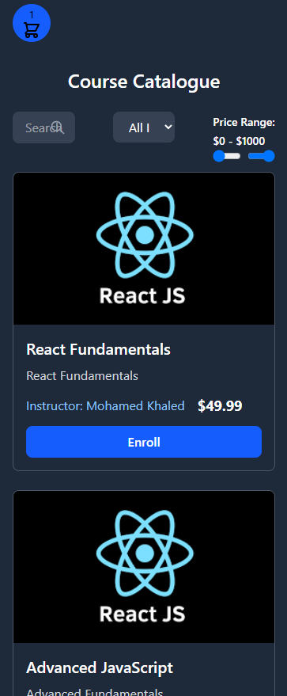

# Course Catalogue

A responsive and interactive course catalogue web app built using react, vite, and tailwind css. Users can browse available courses, add them to a cart, and manage their selections seamlessly through a modern ui

## Tech Stack

- React – Component-based UI
- Vite – Fast development and build tool
- Tailwind css – Utility-first CSS framework for styling

## Demo





## Features

- Browse available courses with course details.
- Add/remove courses to/from a cart.
- Update quantity of selected courses.
- Real-time cart summary with total price and item count.


1. Clone the repository:

   ```bash
   git clone https://github.com/Mohamedkhaled2310/course-catalogue.git
   cd course-catalogue

2. Install dependencies:

   ```bash
   npm i

3. Start server:

   ```bash
   npm run dev


